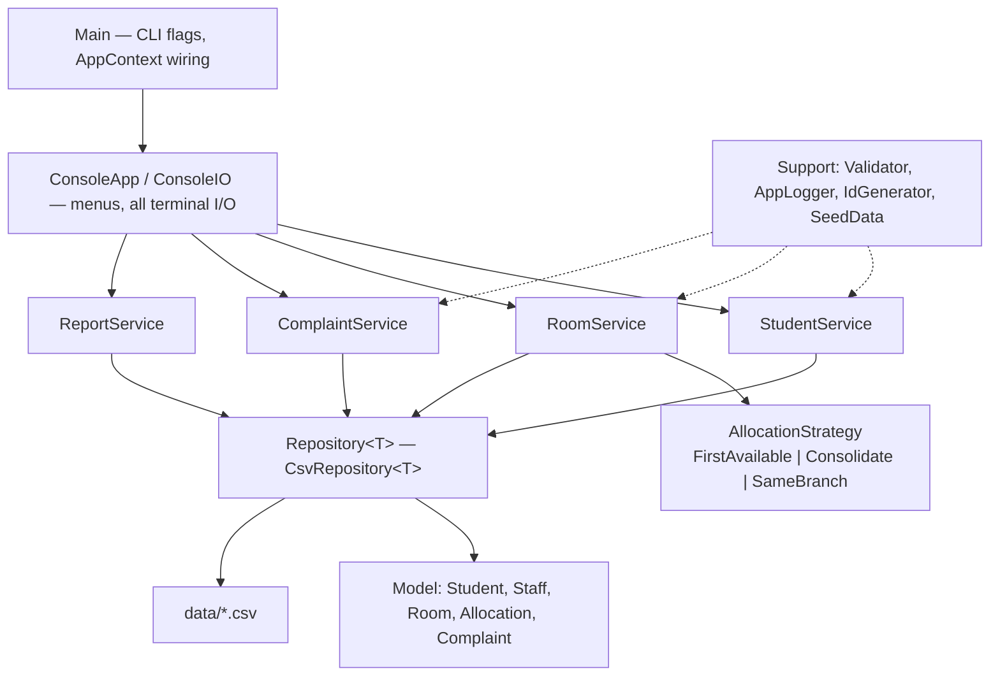
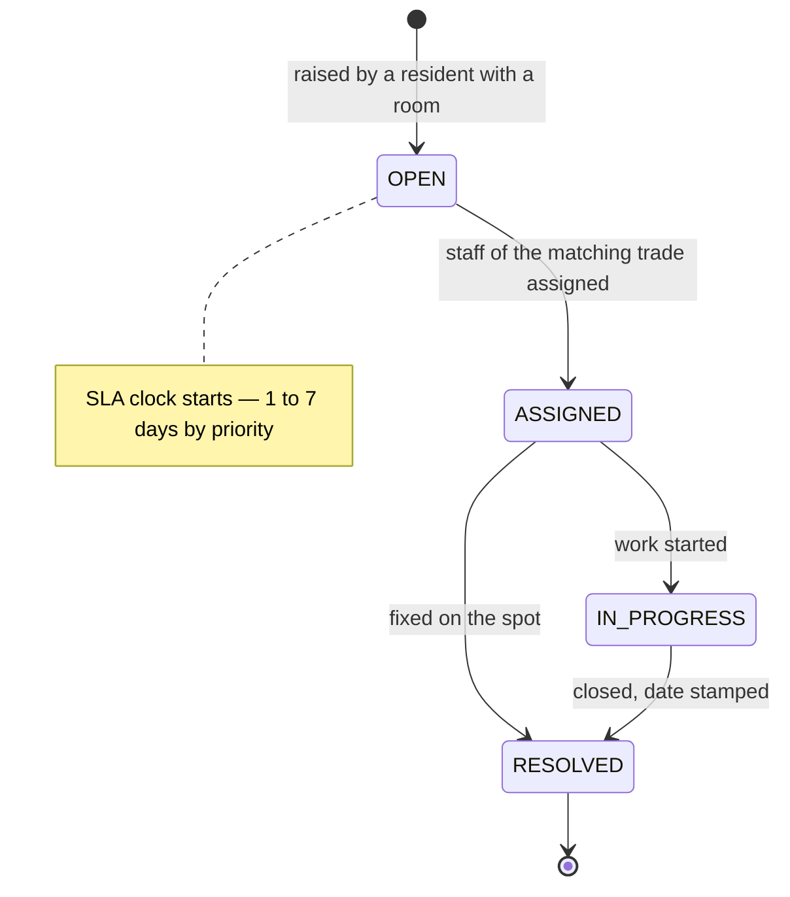
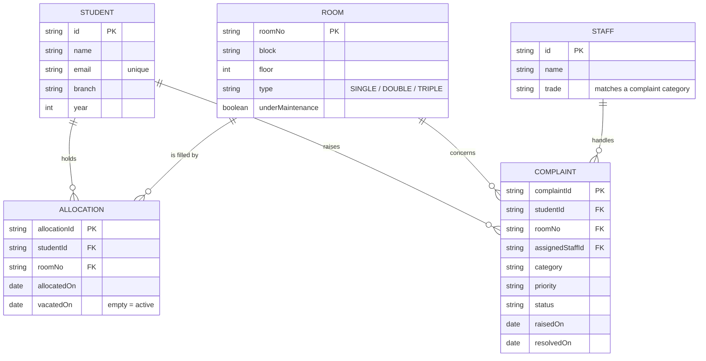

# HostelHub — Hostel Room Allocation & Complaint Desk

A console-based hostel administration system written in plain Java. It handles the three
things a hostel office actually spends its day on: keeping track of who lives there,
deciding who gets which room, and chasing maintenance complaints until they are closed.

No frameworks, no build tool, no database, no folders to navigate — every `.java` file
sits in the root and the whole thing compiles with one `javac` command.

---

## Why I built this

Our hostel office still runs on a register and a WhatsApp group. Room allocation is done
by whoever is at the desk, so rooms end up half-filled across three floors while the
warden keeps every corridor lit. Complaints get written on a slip that goes missing.

So the two things I wanted the program to do properly were: allocate rooms by an
explicit, swappable rule instead of by whoever is standing there, and make a complaint
impossible to lose once it is logged.

---

## Features

**Student registry**
- Register students with validated email, phone, branch and year
- Search by name, ID or branch; update contact details; remove a record
- Listing shows each student's current room, pulled live from the allocation records

**Rooms & allocation**
- 24 seeded rooms across two blocks and three floors, in single / double / triple types
- Three interchangeable allocation strategies you can switch at runtime:
  - *First Available* — lowest room number with a free bed
  - *Consolidate Occupancy* — fills part-occupied rooms before opening empty ones
  - *Same Branch Grouping* — puts a student with same-branch, same-year roommates
- Manual override when the warden wants a specific room
- Vacating closes the allocation instead of deleting it, so occupancy history survives
- Rooms can be flagged out of service for maintenance (blocked if anyone still lives there)

**Complaint desk**
- Raise complaints against the student's current room, by category and priority
- Each priority carries its own SLA (URGENT 1 day → LOW 7 days)
- Complaints can only move OPEN → ASSIGNED → IN_PROGRESS → RESOLVED
- Staff can only be assigned work matching their trade; the system suggests the least
  loaded eligible person
- Overdue list showing everything that has crossed its SLA

**Reports**
- Occupancy by block with bed counts and percentages
- Rooms with free beds, sorted by how much space is left
- Complaint summary by status and category, average resolution time, SLA breaches
- Resident digest — housed vs waiting, split by branch

---

## Technologies used

| Thing | What / why |
|---|---|
| Language | Java (built and tested on JDK 21; the source uses nothing newer than Java 8 syntax, so JDK 8+ works) |
| Persistence | Plain CSV files under `data/`, written through a generic repository |
| Build | `javac *.java` directly, wrapped in `run.sh` / `run.bat`. No Maven or Gradle |
| Tests | A reflection-based runner in `TestRunner.java` — no JUnit jars to download |
| Logging | A hand-rolled append-only logger writing to `logs/app.log` |

---

## Requirements

- JDK 8 or newer (`javac` must be on your PATH)
- A terminal. There is no GUI and nothing to install beyond the JDK.

```bash
java -version
javac -version
```

If `javac` is missing you have a JRE, not a JDK — install `openjdk-21-jdk` (Linux),
`brew install openjdk` (macOS), or the Temurin MSI (Windows).

---

## Setup and run

### 1. Clone

```bash
git clone https://github.com/<your-username>/hostelhub.git
cd hostelhub
```

### 2. Run it

**Linux / macOS**

```bash
chmod +x run.sh test.sh     # only needed the first time
./run.sh
```

**Windows**

```bat
run.bat
```

**Or do it by hand** — this is all the scripts actually do:

```bash
mkdir out
javac -d out *.java
java -cp out Main
```

There is no configuration file to edit and nothing to set up beforehand. On the very
first run the program notices that `data/` is empty and lays down a starter hostel —
24 rooms, 6 maintenance staff and 5 sample students — so you land in a working system
instead of an empty menu.

### 3. Command line options

```bash
java -cp out Main              # interactive menu
java -cp out Main --report     # print every report and exit
java -cp out Main --data demo  # use ./demo as the data folder
java -cp out Main --help       # usage
```

`--report` is the quickest way to confirm the build works without touching the menus:

```bash
./run.sh --report
```

---

## Trying it out in 60 seconds

1. Start with `./run.sh`
2. Choose **2** (Rooms & allocation) → **2** (Allocate a room) → student ID `STU001` →
   **1** (let the system choose) → **3** (TRIPLE)
3. Repeat for `STU002` — with the default *Consolidate Occupancy* strategy it lands in
   the same room, which is the whole point of that rule
4. Choose **0** to go back, then **3** (Complaint desk) → **1** to raise a complaint for
   `STU001`. Watch it suggest a staff member by trade and workload
5. Choose **4** (Reports) → **5** to see everything at once
6. Choose **0** from the main menu to save and exit — reopen the app and your data is
   still there

You can also drive it from a pipe, which is handy for a quick smoke test:

```bash
printf '2\n2\nSTU001\n1\n3\n0\n4\n5\n0\n0\n' | ./run.sh
```

---

## Running the tests

```bash
./test.sh          # Linux / macOS
test.bat           # Windows
```

33 tests covering room capacity rules, validation, all three allocation strategies, the
complaint lifecycle and CSV round trips. The runner prints a pass/fail line per test and
exits with status 1 if anything fails.

```
============================================================
Passed: 33   Failed: 0
All good.
```

Tests write to `build/test-data/`, never to your real `data/` folder.

---

## Project structure

Eight source files, about thirty classes. They are grouped by layer rather than split one
class per file, because the whole project lives in a flat folder with no packages:

| File | Contains | Layer |
|---|---|---|
| `Main.java` | `Main`, `AppContext` | entry point + wiring |
| `ConsoleApp.java` | `ConsoleApp`, `ConsoleIO` | presentation |
| `Services.java` | `StudentService`, `RoomService`, `ComplaintService`, `ReportService` | business rules |
| `Strategy.java` | `AllocationStrategy` + 3 implementations | allocation policy |
| `Model.java` | `Person`, `Student`, `Staff`, `Room`, `Allocation`, `Complaint`, `RoomType`, `Priority`, `ComplaintStatus`, `ComplaintCategory` | domain |
| `Repository.java` | `Identifiable`, `CsvSerializable`, `Repository<T>`, `CsvRepository<T>`, `CsvUtil` | storage |
| `Support.java` | 6 exception classes, `Validator`, `AppLogger`, `IdGenerator`, `SeedData` | cross-cutting |
| `TestRunner.java` | runner, `Assert`, `TestSupport` + 5 test classes | tests |

Generated at runtime (both are gitignored):

```
data/     students.csv, staff.csv, rooms.csv, allocations.csv, complaints.csv
logs/     app.log
```

---

## Architecture

Dependencies point one way only: the UI knows about services, services know about
repositories and the model, and the model knows about nothing above it. That is what lets
the tests build services directly, with no console attached.



### Complaint lifecycle

A complaint cannot skip a step. `ComplaintStatus.canMoveTo()` owns this rule, so no
service can route around it:



### Data model



---

## A few design notes

**Why the room, not the student, owns the occupancy.** My first version stored a
`roomNo` field on `Student`. That falls apart the moment someone vacates — you either
lose the history or you start keeping two copies of the same fact. Now `Allocation` is
the only record of who lives where, and vacating closes the record rather than erasing
it.

**Why the allocation rule is an interface.** The warden's rule changes between terms.
Rather than an `if` ladder inside `RoomService`, each rule is an `AllocationStrategy`
that can be swapped from the menu while the program is running.

**Why capacity and SLA sit on the enums.** `RoomType` knows its own bed count,
`Priority` knows its own SLA. Put either in a service and you end up with a second copy
somewhere that eventually disagrees with the first.

**Why CSV descriptions get sanitised.** Free text is cleaned at entry — commas become
semicolons — instead of writing a full quote-aware CSV parser. For a complaint
description nothing meaningful is lost, and the storage layer stays short enough to read
in one sitting. `TestRunner` covers this case explicitly.

**Why the tests use reflection instead of JUnit.** JUnit means shipping jars or a build
tool that downloads them. Anyone cloning this repo should be able to run the tests with
nothing but a JDK.

---

## Known limitations

- Single user, single process — the CSV files are not safe for concurrent access
- Data is written on exit or on "Save data now"; a hard kill loses the current session
- No authentication; anyone with terminal access is effectively the warden
- Rent is defined per room type and not yet tracked as actual payments

## Possible next steps

- Swap the CSV repository for SQLite (the `Repository` interface already isolates this)
- Fee tracking and dues reports
- Export reports to CSV or PDF
- Separate student and warden logins with different menus
